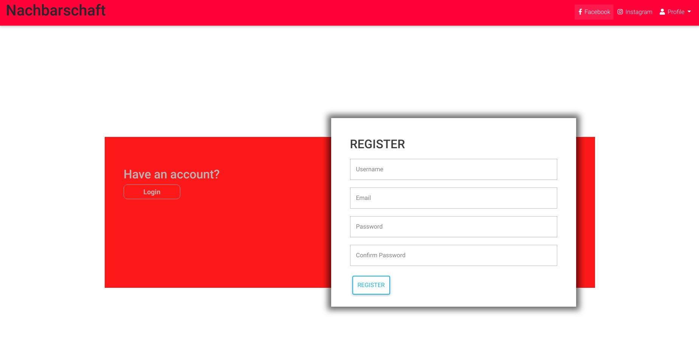

# Nachbarschaft

This is a python web application that allows users to get information about their neighbourhood. Users have profiles in which they will be posting their daily activities happening in their neighbourhood.

## Author 

*   Mohamed Hassan Mohamed

## Project Description

    This is web application that allows users to get information about their neighbourhood. Users have profiles in which they will be posting their daily activities happening in their neighbourhood. Users can also jion and leave neighbourhoods and can aslo delete and post activity happening in their sourrounding.
## Project setup  installation

1.  From the repository, click + in the global sidebar and select Clone this repository under Get to work.
2.  Copy the clone command.
3.  From terminal you use
    '$ git clone <https://github.com/vanmo9/Nachbarschaft/>'

   
## BDD  
 
| BEHAVIOUR | OUTPUT|
|:------------------|:-----------|
| User loads on to the page  |  User Views Sign Up page. |
| User clicks on Sign Up  | Sign Up form dispalys and user fills in detials. |
| User clicks on login  | Login form is displayed and user fills and home page is displayed.  | 
| User Search for different profiles | Searched profile is displayed. |
| User clicks on Profile icon  |  User's profile is displayed. |
| User clicks post icon  |  The post details is displayed and user makes a post. |
| User clicks on update profile icon  |  User Profile is updated. | 

## Technologies Used 

* Python
* CSS
* HTML
* Git  

## Contact Information  

* Email (vanmowha@gmail.com) 

## License ([MIT License](https://github.com/vanmo9/Nachbarschaft/blob/master/LICENSE))
This project is licensed under the MIT Open Source license, (c) [Mohamed Hassan]( )